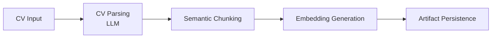
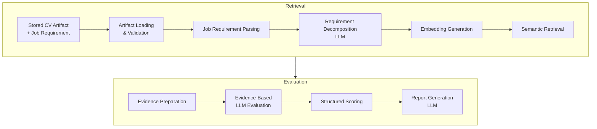

# CV Fit Signal — Multi-Step RAG Evaluation System
## Production-Oriented Multi-Step RAG System for Evidence-Based CV Evaluation
> A multi-step RAG system that evaluates CV fitness against job requirements by grounding decisions in explicit and implicit evidence retrieved from the candidate’s CV.

## Problem
- Traditional CV screening systems often rely on keyword matching, which struggles to capture implicit skills, contextual experience, and evidence quality.
* This project uses Retrieval-Augmented Generation (RAG) to improve CV evaluation by grounding scoring and reasoning in explicit and implicit evidence retrieved from the candidate’s CV.

## Current Status
**Implemented (Stage 1-3)**:
- Requirement-level evidence-based evaluation system
- Modular RAG inference pipeline with FAISS semantic retrieval
- LLM-based structured CV parsing and semantic chunking
- Structured scoring and recruiter-style report generation
- Robustness and failure handling infrastructure
- Observability, telemetry, and structured JSON logging system

**In Progress (Stage 4)**:
- FastAPI integration
- Async / concurrent workflow optimization
- API authentication and rate limiting
- Middleware and dependency injection architecture

**Planned (Stage 5)**:
- Dockerized deployment workflow
- Reproducible runtime environment
- Containerized inference service

## System Architecture

### 1. CV Preprocess Pipeline



### 2. Inference Pipeline



## Production-Oriented Features
* Structured JSON logging
* **Observability and telemetry** tracking
* Centralized **LLM failure handling**
* **Automatic JSON repair** for structured output
* Configurable timeout and retry mechanism
* Retrieval threshold filtering
* **CV artifact persistence** and integrity validation
* Batch embedding optimization
* **Modular service-oriented architecture**
* Config-driven system behavior
* Business-logic validation and repair for malformed LLM JR decomposition

## Example Output
- Evaluation Output:
```json
{
  "datetime": "07-05-2026 18:54",
  "name": "Ardi Pratama",
  "report": [
    {
      "query": "Experience applying machine learning techniques to real problems",
      "score": 0.425,
      "reason": "Your experience in building a classification pipeline and performing preprocessing tasks showcases your application of machine learning techniques. However, connecting this experience to a specific real-world problem would strengthen the evaluation further."
    },
    {
      "query": "Familiarity with containerization tools (e.g., Docker)",
      "score": 0.0,
      "reason": "No supporting evidence related to containerization tools such as Docker was identified in the CV."
    }
  ],
  "final_score": 0.215
}
```

## Observability & Telemetry
The system includes observability and telemetry infrastructure for monitoring runtime behavior and optimization tradeoffs.

Tracked telemetry includes:
- stage-level pipeline latency
- LLM prompt and completion token usage
- estimated LLM request cost
- structured runtime logs

Purpose:
- identify latency bottlenecks
- analyze token consumption
- improve debugging workflow
- support future production deployment and monitoring

Current Limitation:
- retrieval debugging telemetry is not yet implemented

Example:
- Latency Telemetry:
```json
{
  "levelname": "INFO",
  "name": "src.pipelines.inference_pipeline",
  "message": "API predicted",
  "timestamp": "12/05/2026_15:02",
  "environment": "v.1.2",
  "stage": "inference_service",
  "latencies": {
    "inf_chunk": 24776.89,
    "inf_embed": 522.58,
    "inf_evaluation": 18770.4,
    "inf_report": 3244.16,
    "inf_predict_api": 47324.5
  }
}
```
- Token Usage Telemetry
```json
{
  "levelname": "INFO",
  "name": "src.pipelines.inference_pipeline",
  "message": "Token Tracked",
  "timestamp": "12/05/2026_15:02",
  "environment": "v.1.2",
  "stage": "inference_service",
  "summary": {
    "total_prompt_tokens": 5953,
    "total_completion_tokens": 1377,
    "total_cost_idr": 29.56938
  }
}
```

## Failure Handling
The system includes centralized failure handling to improve robustness and reduce invalid pipeline execution.

Implemented handling includes:
- system-level exception categorization:
  - configuration errors
  - preprocess pipeline errors
  - inference pipeline errors
  - LLM-related errors
- automatic JSON repair for invalid structured LLM output
- configurable timeout and retry mechanism
- retrieval threshold filtering
- artifact validation and integrity checking
- invalid CV input validation
- bootstrap logger fallback before structured logger initialization
- business-logic validation and repair for invalid job requirement decomposition

Example validation log:
```json
{
  "levelname": "WARNING",
  "name": "src.services.chunker",
  "message": "Repairing invalid JR requirement",
  "timestamp": "12/05/2026_22:05",
  "environment": "v.1.2",
  "stage": "inf_chunk_repair",
  "invalid_components": [
    "for operational workflows",
    "for business workflows"
  ]
}
```

Current limitations:
- connection error retry classification is still limited
- telemetry logging is not yet separated into dedicated telemetry storage
- async/concurrent failure orchestration is not yet implemented

## Key Design Decisions
- Combined component-level retrieval with full job requirement retrieval to improve evaluation context coverage
- Separated evaluation into:
  - capability level
  - evidence strength
  - responsibility multiplier
- Performed structured scoring outside the LLM for more deterministic and explainable scoring behavior
- Introduced reusable CV artifact persistence to reduce repeated preprocessing, token usage, and inference latency
- Used semantic retrieval instead of keyword-only matching to capture implicit capability signals
- Added retrieval threshold filtering to reduce hallucination risk from unrelated evidence
- Centralized LLM interaction and failure handling inside a dedicated LLM client
- Structured the system using modular service-oriented pipelines for maintainability, observability, and future API deployment

## Documentation
1. docs/DEV_NOTES.md:
    - Architecture decisions, tradeoffs, observed challenges, limitations, and development notes
2. docs/LATENCY_ANALYSIS.md:
    - Pipeline latency analysis and performance comparison across versions
3. docs/TOKEN_USAGE_ANALYSIS.md:
    - LLM token usage and cost analysis across versions
4. docs/LLM_GENERATION.md:
    - LLM generation realibility analysis

## How to use
### Local Setup
1. Create a Python virtual environment
    - python -m venv .venv 
2. Activate the virtual environment
    - linux: source .venv/bin/activate
    - windows: .venv\Scripts\activate
3. Install Dependencies
    - pip install -r requirements.txt

### Configuration
1. Configure environment variables
    - Open .env.example
    - Follow the instructions inside the file
2. Configure system behavior
    - Edit config.yaml

### Local Usage
1. Run CV preprocessing pipeline
    - python -m src.core.main_preprocess
2. Run inference pipline
    - python -m src.core.main_inference

## Author
Jearim Jarden