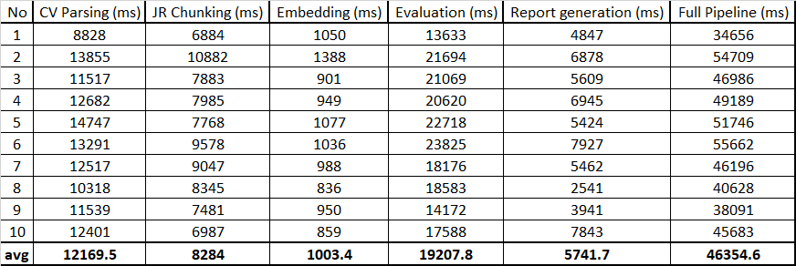
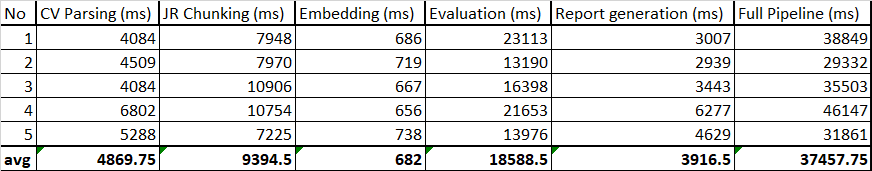
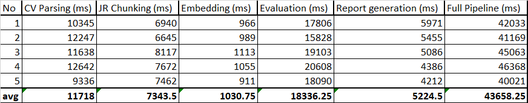
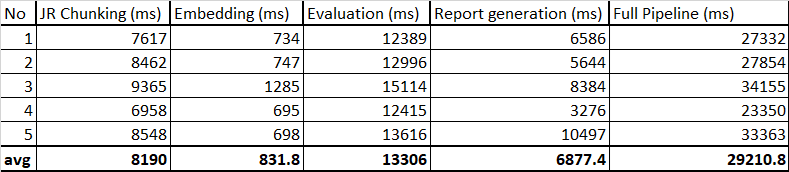
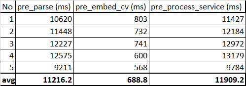
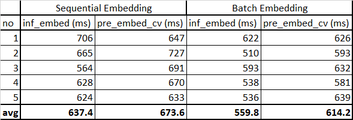
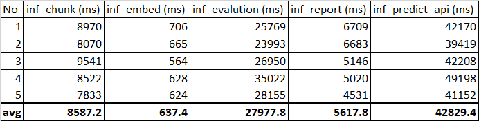

# Latency Analysis
- This analysis covers critical and computationally heavy pipeline stages that are important for performance evaluation
- Latency measurements are collected using the internal latency wrapper and telemetry infrastructure
- All latency measurements are reported in milliseconds (ms)

## CV-fit RAG System v1.1 (7 May 2026)
System Architecture:
- CV and Job Requirement raw inputs 
- CV parsing (LLM)
- Job Requirement decomposing across parsed Job Requirement (LLM)
- Sequential embedding accross parsed CV and Job Requirement
- Sequential Evaluation accross Job Requirement (Original and Components JR) to Retrieved Evidence (LLM)
- Scoring
- Report generation (LLM)

### Analysis 1:
#### Configuration
- cv_parsed = 20
- jr_parsed = 5
- components_top_k = 2
- query_top_k = 3

#### Latency Result

#### Analysis (Full analysis)
- The system latency is dominated by LLM generation stages:
  - CV Parsing
  - JR Chunking
  - Evaluation
  - Report Generation
- Total LLM-related latency contribution:
  - ((12169 + 8284 + 19207 + 5741) / 46354) * 100% ≈ ~98%
- Embedding latency contribution is relatively small compared to LLM generation stages
- Average latency per CV parse:
  - ~608 ms per parse
- Average latency per JR chunk:
  - ~1656 ms per job requirement
- Average latency per evaluation:
  - ~3841 ms per job requirement
- Evaluation and JR chunking are currently sequential and have strong async/concurrent optimization opportunities
- CV preprocessing and artifact persistence can significantly reduce repeated inference latency for repeated CV evaluation workflows

#### Optimization Opportunities
- Storing preprocessed CV artifacts could reduce total latency by approximately ~26%
- Async/concurrent evaluation execution could reduce total latency by approximately ~33%
- Async/concurrent JR chunking could reduce total latency by approximately ~14%

#### Summary
- The system is heavily dominated by LLM generation latency (~98%)
- Evaluation and JR chunking stages contain major async/concurrent optimization opportunities
- CV preprocessing and artifact persistence are valuable because the same CV may be evaluated against multiple job requirements
- Combining CV preprocessing and async optimization opportunities could potentially reduce total latency by up to ~60%

### Analysis 2 (Consistency of average latency):
#### Configuration
- cv_parsed = 9
- jr_parsed = 5
- components_top_k = 2
- query_top_k = 3

#### Latency Result

#### Analysis
- Total LLM-related latency contribution:
  - ((4869 + 9394 + 18588 + 3916) / 37457) * 100% ≈ ~98%
- Average latency per CV parse:
  - ~541 ms per parse
- Average latency per JR chunk:
  - ~1878 ms per job requirement
- Average latency per evaluation:
  - ~3717 ms per job requirement

#### Summary
- This analysis validates the consistency of average latency across:
  - CV parsing
  - JR chunking
  - evaluation
- This analysis also confirms the contribution of LLM-related stages to total pipeline latency
- LLM-related stages consistently contribute approximately ~98% of total latency
- CV parsing latency increases with CV size and the amount of structured information extracted, while maintaining a relatively stable average latency of ~541 ms per parse
- JR chunking latency increases with the number of job requirements, while maintaining a relatively stable average latency of ~1878 ms per job requirement
- Evaluation latency also increases proportionally with the number of job requirements, while maintaining an average latency of approximately ~3717 ms per evaluation

### Analysis 3 (Evidence quantity impact on evaluation):
#### Configuration
- cv_parsed = 20
- jr_parsed = 5
- components_top_k = 2
- query_top_k = 1

#### Latency Result

#### Analysis

- Average latency per evaluation:
  - ~3.667 ms per job requirement

#### Summary
- This analysis evaluates the latency impact caused by changing the amount of retrieved evidence through:
  - components_top_k
  - query_top_k
- The analysis indicates that the number of retrieved evidence items does not significantly affect evaluation latency
- Evaluation latency remains relatively stable even when the number of retrieved evidence items is reduced
- This suggests that evaluation latency is more heavily dominated by LLM generation overhead than evidence quantity itself

## CV-fit RAG System v1.2 (12 May 2026)
System Architecture:
- CV Preprocess Pipeline:
  - CV Parsing - LLM
  - Semantic Chunking
  - Embedding Generation 
  - Artifact Persistance

- Inference Pipeline:
  - Load CV Artifact + Job Requirement
  - Job Requirement parsing
  - Requirement Decomposition - LLM
  - Embedding Generation
  - Semantic Retrieval
  - Evidence Preparation
  - Evidence based Evaluation - LLM
  - Structured Scoring
  - Report Generation - LLM

### Analysis 1 (Inference pipeline without persistance CV):
#### Configuration
- cv_parsed = 27
- jr_parsed = 5
- components_top_k = 2
- query_top_k = 1

#### Latency Result

#### Analysis
- Average latency JR Chunking:
  - ~8190 ms
- Average latency Evaluation:
  - ~13306 ms
- Average latency Report Generation:
  - ~6877 ms
- Average latency Inference Pipeline:
  - ~29210 ms

#### Summary
- With similar average JR chunking, evaluation, and report generation latency, CV artifact persistence reduced inference latency by approximately ~33%
- This confirms the hypothesis from the first analysis in CV-fit RAG System v1.1 (7 May 2026) that CV persistence can significantly reduce full pipeline latency
- Removing repeated CV parsing and embedding stages provides a substantial reduction in total inference time for repeated CV evaluation workflows

### Analysis 2 (Preprocess pipeline):
#### Configuration
- cv_parsed = 20
- cv_chunked = 27

#### Latency Result

#### Analysis
- Average latency pre_parse (CV parsing):
  - ~11216 ms
- Average latency pre_embed_cv (CV chunk embedding):
  - ~688 ms
- Average latency pre_process_service (CV Preprocess Pipeline):
  - ~11909 ms

#### Summary
- This analysis measures the latency of the newly introduced CV Preprocess Pipeline
- Similar to previous analyses, the preprocessing pipeline latency is heavily dominated by LLM generation during the CV parsing stage
- Embedding generation contributes relatively little latency compared to CV parsing
- Persisting preprocessing artifacts enables repeated inference execution without re-running expensive CV parsing and embedding stages

### Analysis 3 (Batch Embedding):

#### Latency Result

#### Analysis
- Average latency for sequential embedding (Inference Pipeline):
  - ~637 ms
- Average latency for sequential embedding (Preprocess Pipeline):
  - ~673 ms
- Average latency for batch embedding (Inference Pipeline):
  - ~559 ms
- Average latency for batch embedding (Preprocess Pipeline):
  - ~614 ms

#### Summary
- Batch embedding provides a small but measurable latency reduction compared to sequential embedding
- The latency improvement is approximately ~10–15%
- Embedding stages contribute relatively little latency compared to LLM generation stages, so overall pipeline improvement is limited
- The primary value of batch embedding is improving embedding efficiency and scalability rather than significantly reducing total pipeline latency

### Analysis 4 (OpenAI API Instability)
#### Configuration
- cv_parsed = 27
- jr_parsed = 5
- components_top_k = 2
- query_top_k = 1

#### Latency Result

#### Analysis
- Average latency inf_chunk (JR chunking):
  - ~8587 ms
- Average latency inf_evaluation:
  - ~27977 ms
- Average latency inf_report:
  - ~5617 ms
- Average latency inf_predict_api:
  - ~42829 ms

#### Summary:
- A significant latency spike was observed in the evaluation stage, increasing from approximately ~13306 ms to ~27977 ms (~100% increase)
- The latency spike was primarily isolated to the evaluation stage, while other stages remained relatively stable
- This behavior suggests that OpenAI API instability or overload conditions can significantly impact evaluation latency because has harder reasoning complexity
- Re-running the same analysis approximately one day later returned evaluation latency to normal levels (~14000 ms)
- This observation highlights the importance of timeout handling, retry mechanisms, telemetry tracking, and future async/concurrent optimization strategies for production-oriented LLM systems
