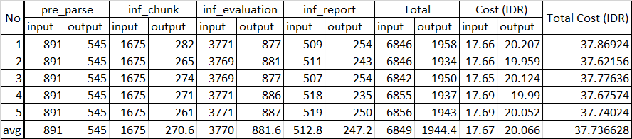
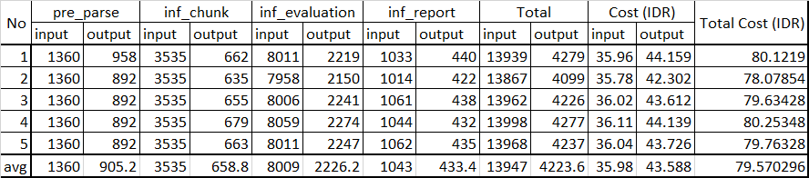
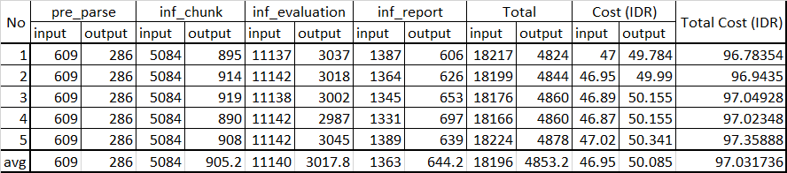

# LLM Generation Analysis
- This analysis evaluates output token consistency across repeated executions
- Lower output variation indicates more stable generation behavior

## Analysis

### pre_parse (Raw CV → Structured CV)
- Output token generation is highly stable across repeated runs
- Structured parsing prompts produce highly consistent output size
- pre_parse has the highest output reliability among all stages

### inf_chunk (Raw Job Requirement → Decomposed Requirements)
- Output token variation remains relatively low
- Structured decomposition constraints reduce generation variability
- inf_chunk has high output consistency

### inf_evaluation (Requirement Evaluation)
- Output token variation is moderate but still relatively stable
- Reasoning depth and evidence interpretation slightly affect output size
- Structured evaluation formatting helps maintain consistency

### inf_report (Evaluation Results → Recruiter-Style Report)
- inf_report shows the highest output variation among all stages
- Natural-language report generation introduces more variability in wording and response length
- inf_report has the lowest output consistency

## Overall Observation
- Structured extraction stages (pre_parse and inf_chunk) produce the most stable output behavior
- Reasoning-heavy stages (inf_evaluation) introduce moderate variability
- Natural-language summarization stages (inf_report) produce the highest variability
- Structured JSON constraints significantly improve overall output consistency